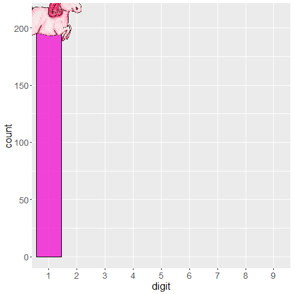

# under construction

I didn't get around to setting up this page properly yet, but look at this unicorn presenting you [Benford's Law](https://en.wikipedia.org/wiki/Benford%27s_law) while waiting!

```{r setup, echo = FALSE, message = FALSE, warning = FALSE}
knitr::opts_chunk$set(message = FALSE, warning = FALSE, echo = FALSE, include = TRUE, 
                      fig.align = "center")

library(knitr)
```

```{r, out.width = '60%'}

```

Came here for the [Skeptics in the Pub talk](https://einglasrotwein.github.io/skeptics_praesi)?
